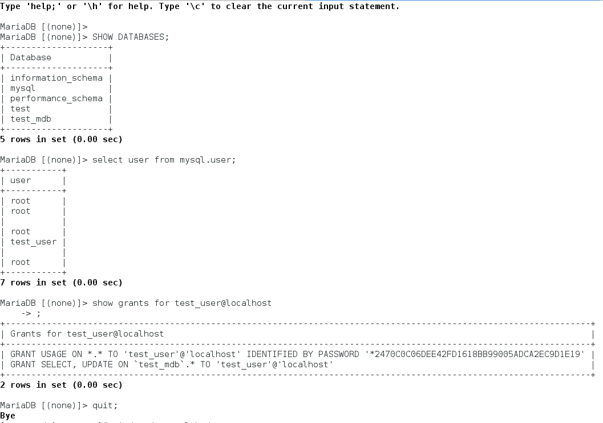

# lesson12

> **Contents:**

> - **puppet_agent.log** - output log of puppet agent on the node1.kuzniatsou.com
> - **site.pp** - manifest with MySQL

### MySQL on the node1.kuzniatsou.com. DB, user, privileges

